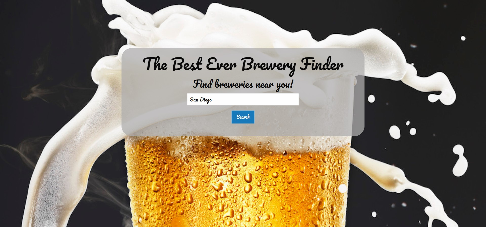

# The BEST Brewery Finder
A brewery locater developed by [Austin Perez](https://github.com/AustinPerez760), [Dillon Hoban](https://github.com/dillonhoban), and [Tim Hoyt](https://github.com/Timhoyt824)

## Description
The goal of this project was to gain a better understanding of API usage through practical implementation and a real world team setting. We started with our user story and referenced it as a road map for building out app:

AS A lover of beer and good times
I WANT a simple lightweight app that can find breweries in my area and give me basic information about the establishments
So THAT I don’t waste any time in choosing my next destination to get my sweet drink on

From there we researched and decided on the APIs we wanted to use to accomplish our MVP. We ran into several snags along the way the largest of which being an issue with asynchronous loading of the brewery data and HTML elements resulting in all of our data being added to one of the five dynamically created containers. We figured out a different way to construct the pages HTML but hope to do more research on promisify functions to avoid issues like this in the future. 

This project also added to our knowable of GitHub as this was the first time all of us had used a shared repository. We learned a lot about pushing changes, creating pull requests, and working in different branches. 

## Deployment
Click the **[link here](https://dillonhoban.github.io/The_BEST_Brewery_Finder/)** to check out our site in your browser.

## Future Updates
We hope to improve the functionality of the app including adding results displayed by the APIs to include the address of the brewery and possibly including the Google Map API to imbed directions in our app. 

## Acknowledgments
Background image provided by [JustBeer](https://justbeerapp.com/article/how-the-foam-on-your-beer-keeps-it-from-spilling) APIs used include [OpenBrewery](https://www.openbrewerydb.org/) and [LinkPreview](https://www.linkpreview.net/) Framework used [Foundation](https://get.foundation/) by ZURB

## Validation 
This site’s HTML was validated using a third party service found [here.](https://validator.w3.org/)

## License
[MIT](https://choosealicense.com/licenses/mit/)

  
   
  
  
  

